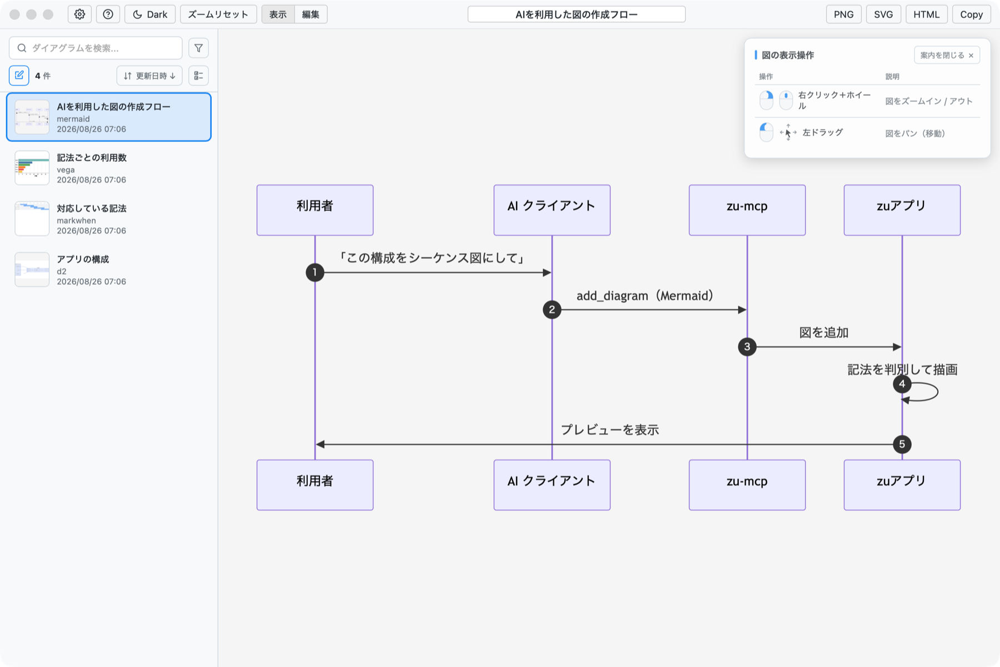
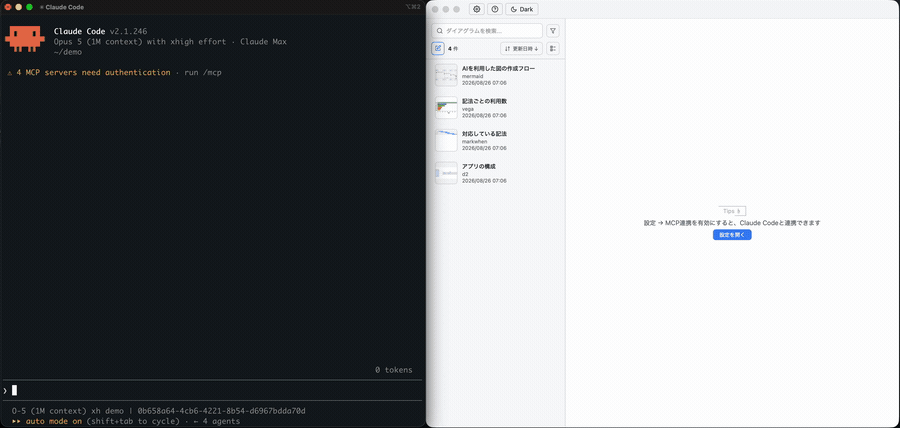
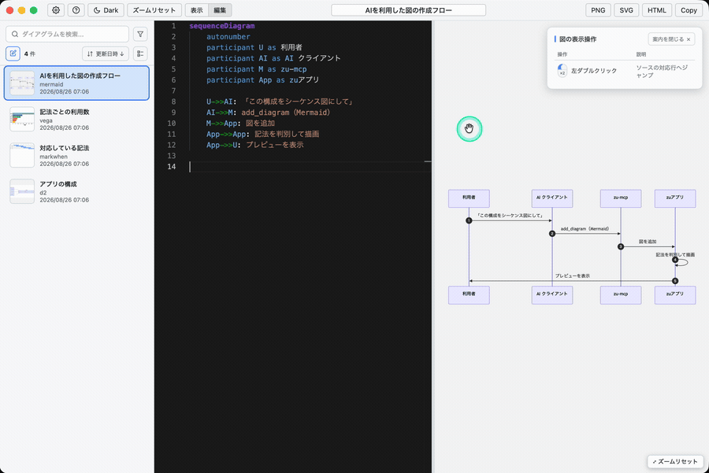

<p align="center">  </p>

<h1 align="center">zu</h1>

<p align="center"> <a href="https://github.com/sunanana/zu-releases/releases/latest"></a>  </p>

<p align="center"> <a href="https://github.com/sunanana/zu-releases/releases/download/v0.20.1/zu_0.20.1_aarch64.dmg"></a> </p>

<p align="center">  </p>

## 機能

* **12種類の記法に対応** — Mermaid / PlantUML / D2 / Graphviz / Vega・Vega-Lite / MarkWhen / flowchart.js / bytefield / WireViz / CircuiTikZ / Marp / Markdown
* **AIによる作図** — MCP連携で、AIとの会話の中で「この構成をシーケンス図にしてzuに入れて」と依頼すると作図出来ます。Claude Code・Claude Desktop・Codex・Antigravityに対応。
* **自分で作図** — サイドバーの新規作成アイコンから作成でき、編集も可能です。
* **書き出す** — PNG / SVG / HTML / PDF(Marpのみ) / プリンター印刷
* **図種ごとのスタイルガイドを定義** — スタイルガイドを図種ごとに書いておくと、AI が作図時にそれを読んで従います。例えばmermaidのER図の定義するとそれに従いER図のデザインを設定します。

## インストール

1. [zu_0.20.1_aarch64.dmg](https://github.com/sunanana/zu-releases/releases/download/v0.20.1/zu_0.20.1_aarch64.dmg) をダウンロードします(過去の版は [Releases](https://github.com/sunanana/zu-releases/releases) から)
2. dmg を開き、`zu.app` を `Applications` へドラッグします
3. `zu.app` を起動します。メニューバーにアイコンが出れば起動しています

## AI クライアントと連携する

zu には アプリ起動中に立ち上がるMCPサーバー `zu-mcp` が同梱されています。
AI クライアントに MCP 接続すると、AI との会話から図を追加しアプリですぐにプレビュー・編集できます。

### AIでの作図

<p align="center">  </p>

対応しているクライアントは次の 4 つです。

* Claude Code
* Claude Desktop
* Codex(CLI / ChatGPT デスクトップアプリ / IDE 拡張)
* Antigravity

### Claude Codeにzuのpluginを導入

```bash
claude plugin marketplace add "$HOME/Library/Application Support/com.sunaco.zu/claude-plugin" && claude plugin install zu@zu-app
```

### Codex CLIにzuのMCPサーバーを導入

```bash
codex mcp add zu -- /Applications/zu.app/Contents/Resources/zu-mcp
```

### MCPツール一覧

| MCP ツール名 | 内容 |
| --- | --- |
| `add_diagram` | 図を追加する |
| `list_diagrams` | 追加済みの図を一覧する |
| `check_[diagram]_syntax` | 追加前に記法を検証する(Mermaid / D2 / Vega / MarkWhen / flowchart / bytefield / WireViz / Graphviz / CircuiTikZ / Marp) |
| `get_[diagram]_style_guide` | 図種ごとのスタイルガイドを読む |
| `update_[diagram]_style_guide` | スタイルガイドを書き換える |

## エディターモード

エディターモードではライブプレビューでの即時表示。
図の要素をダブルクリックすると対応するコードジャンプします(mermaid/Marp/Markdownのみ)

<p align="center">  </p>

## 動作環境

* macOS(Apple Silicon)
* Apple の Developer ID で署名・公証済み
